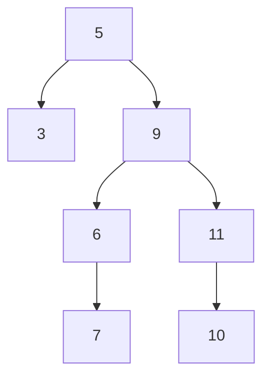

# 3. Gegeben ist der folgende binäre Baum:

![[Pasted image 20240912145543.png]]


## a) Bestimmen Sie jeweils die Durchlaufreihenfolge für die drei Traversierungsvarianten Preorder, Inorder und Postorder.

>[!tip]- Merkzettel: Traversierungsvarianten in Binärbäumen
>
> ### Beispielhafter Binärbaum:
> ```
>         A
>        / \
>       B   C
>      / \   \
>     D   E   F
> ```
>
> ### Preorder (Wurzel → links → rechts)
> Du gehst einen Pfad entlang und schreibst alle Knoten dabei auf
> 1. Wurzel besuchen.
> 2. Linken Teilbaum traversieren.
> 3. Rechten Teilbaum traversieren.
> **Reihenfolge:** A, B, D, E, C, F
>
> ### Inorder (links → Wurzel → rechts)
> Du gehst immer so weit links wie möglich und danach Wurzel und dann den rechten Teilbaum
> 1. Linken Teilbaum traversieren.
> 2. Wurzel besuchen.
> 3. Rechten Teilbaum traversieren.
> **Reihenfolge:** D, B, E, A, C, F
>
> ### Postorder (links → rechts → Wurzel)
> 1. Linken Teilbaum traversieren.
> 2. Rechten Teilbaum traversieren.
> 3. Wurzel besuchen.
> **Reihenfolge:** D, E, B, F, C, A
> <br/>
> <div style="position: relative; width: 100%; height: 0; padding-bottom: 56.25%;"><iframe src="https://www.youtube.com/embed/b_NjndniOqY" title="YouTube video player" style="position: absolute; top: 0; left: 0; width: 100%; height: 100%;" frameborder="0" allow="accelerometer; autoplay; clipboard-write; encrypted-media; gyroscope; picture-in-picture; web-share" referrerpolicy="strict-origin-when-cross-origin" allowfullscreen></iframe></div><br>

### Preorder (Wurzel → links → rechts)

$$
\text{Preorder: } 5,3,9,6,7,11,10
$$

### Inorder (links → Wurzel → rechts)

$$
\text{Inorder: } 3,5,6,7,9,10,11
$$

### Postorder (links → rechts → Wurzel)

$$
\text{Postorder: } 3,7,6,10,11,9,5
$$

## b) Gegeben sind die Preorder- und die Inordertraversierung eines binären Baumes.


>[!note] Aufgabenstellung
>**Preorder**: 1, 2, 4, 3, 5, 6, 7  
>**Inorder**: 4, 2, 1, 6, 5, 7, 3  
>
>Rekonstruieren Sie den Aufbau des binären Baums und stellen Sie ihn mit Knoten und Kanten dar.

### Anleitung

- Wir wissen, dass in Preorder die erste Zahl immer die Wurzel ist (hier → `1`)
- Wir schauen nun in *Inorder* wo die `1` steht
- Alles Links von der `1` ist im linken Teilbaum, alles rechts davon im rechten Teilbaum

```text
			1
		  /   \
	{4,2}	  {6,5,7,3}
```

- Zur Hilfe streiche nun die Zahlen durch:

$$
\begin{aligned}
&\text{Preorder: } &\cancel{1},2,4,3,5,6,7\\
&\text{Inorder: } &4,2,\cancel{1},6,5,7,3
\end{aligned}
$$

- Gehe jetzt die Preorder Traversierung weiter durch und wir sehen als nächstes kommt `2` dran
- Wir machen nun das gleiche für die `2`
- Wir schauen wo die `2` in der Inorder Schreibweise steht und markieren uns was links und rechts von steht

$$
\begin{aligned}
&\text{Preorder: } &\cancel{1},\underline{2},4,3,5,6,7\\
&\text{Inorder: } &4,\underline{2},\cancel{1},6,5,7,3
\end{aligned}
$$
- links davon steht die $4$ und rechts davon die $1$, weil die $1$ schon benutzt wurde ($\cancel{1}$) können wir sie ignorieren

```text
			1
		  /   \
		 2    {6,5,7,3}
		/       
	   4 	  
```

- wir markieren die `2` nun als erledigt

$$
\begin{aligned}
&\text{Preorder: } &\cancel{1},\cancel{2},4,3,5,6,7\\
&\text{Inorder: } &4,\cancel{2},\cancel{1},6,5,7,3
\end{aligned}
$$
- wiederhole nun das ganze bis wir fertig sind

$$
\begin{aligned}
&\text{Preorder: } &\cancel{1},\cancel{2},\underline{4},3,5,6,7\\
&\text{Inorder: } &\underline{4},\cancel{2},\cancel{1},6,5,7,3
\end{aligned}
$$
- `4` hat keine freien Nachbarn mehr also fertig

$$
\begin{aligned}
&\text{Preorder: } &\cancel{1},\cancel{2},\cancel{4},\underline{3},5,7\\
&\text{Inorder: } &\cancel{4},\cancel{2},\cancel{1},6,5,7,\underline{3}
\end{aligned}
$$
```text
			1
		  /   \
		 2     3
		/     / 
	   4 	{6,5,7}  
```

$$
\begin{aligned}
&\text{Preorder: } &\cancel{1},\cancel{2},\cancel{4},\cancel{3},\underline{5},6,7\\
&\text{Inorder: } &\cancel{4},\cancel{2},\cancel{1},6,\underline{5},7,\cancel{3}
\end{aligned}
$$

```text
			1
		  /   \
		 2     3
		/     / 
	   4 	 5
	       /   \
          6     7
```

- Da `6 und 7` keine freien Nachbarn in Inorder haben sind wir fertig 
$$
\begin{aligned}
&\text{Preorder: } &\cancel{1},\cancel{2},\cancel{4},\cancel3,\cancel{5},\cancel{6},\cancel7\\
&\text{Inorder: } &\cancel{4},\cancel{2},\cancel{1},\cancel{6},\cancel{5},\cancel7,\cancel3
\end{aligned}
$$

#### Finaler Baum:

```java
			1
		  /   \
		 2     3
		/     / 
	   4 	 5
	       /  \
          6     7
```

### Zusatzfrage 1: Was ist die Postordertraversierung davon?

>[!success]- Lösung
>$$
> \text{Postorder: }  4, 2, 6,7,5,3,1
>$$

### Zusatzfrage 2: BB von Post-Order und In-Order

$$
\begin{aligned}
 &\text{Post-Order: }  &4, 2, 6,7,5,3,1\\
 \\
 &\text{In-Order: }  &4, 2, 1, 6, 5, 7, 3 
\end{aligned}
 $$
 
- sehr ähnlich zu Pre-Order und In-Order 
- Wir fangen nur nun von rechts an statt von links, da bei Post-Order die Wurzel ganz rechts ist

### Lösung

1. Die **letzte** Zahl der Postorder ist immer die Wurzel des Baumes. Hier also:
   $$
   \text{Post-Order: } 4, 2, 6, 7, 5, 3, \underline{1}
   $$
   
   In der Inorder-Liste steht `1` an folgender Stelle:
   $$
   \text{In-Order: } 4, 2, \underline{1}, 6, 5, 7, 3
   $$
   
   - Alles **links** von `1` gehört zum **linken** Teilbaum (4, 2).
   - Alles **rechts** von `1` gehört zum **rechten** Teilbaum (6, 5, 7, 3).

```text
         1
       /   \
   {4,2}   {6,5,7,3}
```

2. Die nächste Wurzel aus der Postorder ist `3`:
   $$
   \text{Post-Order: } 4, 2, 6, 7, 5, \underline{3}, \cancel{1}
   $$
   
   In der Inorder-Liste steht `3` hier:
   $$
   \text{In-Order: } 4, 2, \cancel{1}, 6, 5, 7, \underline{3}
   $$
   
   - Links von `3` steht (6, 5, 7), das der **linke Teilbaum** von `3` ist.
   
```text
         1
       /   \
 . {4,2}    3
           /
      {6,5,7}
```

3. Nun nehmen wir `5` aus der Postorder:
   $$
   \text{Post-Order: } 4, 2, 6, 7, \underline{5}, \cancel{3}, \cancel{1}
   $$
   
   In der Inorder-Liste steht `5` hier:
   $$
   \text{In-Order: } 4, 2, \cancel{1}, 6, \underline{5}, 7, \cancel{3}
   $$
   
   - Links von `5` steht `6`, das der **linke Teilbaum** von `5` ist.
   - Rechts von `5` steht `7`, das der **rechte Teilbaum** von `5` ist.
   
```text
         1
       /   \
   {4,2}    3
           /
          5
         / \
        6   7
```

4. Als nächstes kommt `7`:
   $$
   \text{Post-Order: } 4, 2, 6, \underline{7}, \cancel{5}, \cancel{3}, \cancel{1}
   $$
   
   - `7` hat keine weiteren Kinder in der Inorder-Liste.
   
```text
         1
       /   \
   {4,2}    3
           /
          5
         / \
        6   7
```

5. Jetzt nehmen wir `6` aus der Postorder:
   $$
   \text{Post-Order: } 4, 2, \underline{6}, \cancel{7}, \cancel{5}, \cancel{3}, \cancel{1}
   $$
   
   - `6` hat keine weiteren Kinder, da es in der Inorder-Liste alleine steht.
   
```text
         1
       /   \
   {4,2}    3
           /
          5
         / \
        6   7
```

6. Zum Schluss verarbeiten wir den linken Teilbaum. Die nächste Zahl aus der Postorder ist `2`:
   $$
   \text{Post-Order: } 4, \underline{2}, \cancel{6}, \cancel{7}, \cancel{5}, \cancel{3}, \cancel{1}
   $$
   
   In der Inorder-Liste steht `2` hier:
   $$
   \text{In-Order: } 4, \underline{2}, \cancel{1}, 6, \cancel{5}, \cancel{7}, \cancel{3}
   $$
   
   - Links von `2` steht `4`, das der **linke Teilbaum** von `2` ist.
   
```text
         1
       /   \
      2     3
     /     /
    4     5
         / \
        6   7
```

7. Zum Schluss verarbeiten wir `4`:
   $$
   \text{Post-Order: } \underline{4}, \cancel{2}, \cancel{6}, \cancel{7}, \cancel{5}, \cancel{3}, \cancel{1}
   $$
   
   - `4` hat keine weiteren Kinder.
   
```text
         1
       /   \
      2     3
     /     /
    4     5
         / \
        6   7
```

### Fazit

Der rekonstruierte Baum sieht so aus:

```text
         1
       /   \
      2     3
     /     /
    4     5
         / \
        6   7
```


### Zusatzfrage 3: Pre-Order und Post-Order 

>[!WARNING] **Achtung: Mehrdeutigkeit bei Preorder und Postorder**
>
>Die Rekonstruktion eines binären Baums **nur** anhand der **Preorder-** und **Postorder-Traversierung** ist **nicht eindeutig**. Beide Traversierungen liefern nicht genügend Informationen, um die Baumstruktur in allen Fällen klar zu definieren, insbesondere bei:
>
>- Knoten mit nur **einem Kind** (einseitige Bäume),
>- Situationen, in denen die **Reihenfolge der Kinder** unklar ist.
>
>Das bedeutet, dass Preorder und Postorder zu mehreren möglichen Baumstrukturen führen können. Um einen binären Baum **eindeutig** zu rekonstruieren, ist die **Inorder-Traversierung** oder zusätzliche Informationen erforderlich.

>[!warning]- Nicht eindeutig bestimmbar (damit du es mal gesehen hast)
> ### Beispiel zur Mehrdeutigkeit von Preorder und Postorder
> 
> Nehmen wir an, wir haben die folgenden Arrays gegeben:
> 
> $$
> \begin{aligned}
> &\text{Preorder: } 1, 2, 4, 8, 9, 5, 3, 6, 7 \\
> &\text{Postorder: } 8, 9, 4, 5, 2, 6, 7, 3, 1
> \end{aligned}
> $$
> 
> #### Schritt 1: Wurzel identifizieren
> In der **Preorder**-Liste ist das **erste Element immer die Wurzel** des Baums. Also ist `1` die Wurzel:
> 
> $$
> \text{Preorder: } \underline{1}, 2, 4, 8, 9, 5, 3, 6, 7
> $$
> $$
> \text{Postorder: } 8, 9, 4, 5, 2, 6, 7, 3, \underline{1}
> $$
> 
> #### Schritt 2: Linken Teilbaum bestimmen
> Das Element **direkt nach der Wurzel** in der Preorder-Liste ist immer das linke Kind der Wurzel. Hier ist `2` das linke Kind von `1`.
> 
> Nun müssen wir den gesamten linken Teilbaum von `1` bestimmen. In der **Postorder**-Liste endet der linke Teilbaum immer direkt **vor** der Wurzel. Da `2` der Wurzel des linken Teilbaums ist, sind alle Elemente vor `2` in der Postorder-Liste Teil des linken Teilbaums:
> 
> $$
> \text{Postorder: } 8, 9, 4, 5, \underline{2}, 6, 7, 3, \cancel{1}
> $$
> 
> Die Knoten {8, 9, 4, 5, 2} gehören also zum linken Teilbaum von `1`, und {6, 7, 3} gehören zum rechten Teilbaum.
> 
> Der Baum sieht also nun folgendermaßen aus:
> 
> ```text
>                   1
>                 /   \
>    {8, 9, 4, 5, 2}     {6, 7, 3}
> ```
> 
> #### Schritt 3: Rekursion im linken Teilbaum
> Wir wenden nun das gleiche Prinzip rekursiv auf den linken Teilbaum an. In der Preorder-Liste sehen wir, dass `2` die Wurzel dieses Teilbaums ist, und `4` ist das linke Kind von `2`:
> 
> $$
> \text{Preorder: } \cancel{1}, \underline{2}, 4, 8, 9, 5, 3, 6, 7
> $$
> 
> In der Postorder-Liste sehen wir, dass der Teilbaum von `2` mit `4` und `5` gefüllt ist:
> 
> $$
> \text{Postorder: } 8, 9, \underline{4}, 5, \cancel{2}, 6, 7, 3, \cancel{1}
> $$
> 
> Somit ist `4` das linke Kind von `2` und `5` das rechte Kind.
> 
> #### Schritt 4: Rekursion im Teilbaum von `4`
> `8` und `9` sind die Kinder von `4`, da sie in der Preorder-Liste direkt nach `4` folgen:
> 
> $$
> \text{Preorder: } \cancel{1}, \cancel{2}, \underline{4}, 8, 9, \cancel{5}, 3, 6, 7
> $$
> $$
> \text{Postorder: } \underline{8}, \underline{9}, \cancel{4}, 5, \cancel{2}, 6, 7, 3, \cancel{1}
> $$
> 
> Da `8` und `9` in der Postorder-Liste hintereinander kommen, sind sie die linken und rechten Kinder von `4`.
> 
> #### Schritt 5: Rechter Teilbaum von `1`
> Jetzt verarbeiten wir den rechten Teilbaum. In der Preorder-Liste ist `3` die Wurzel des rechten Teilbaums, mit `6` und `7` als Kinder:
> 
> $$
> \text{Preorder: } \cancel{1}, \cancel{2}, \cancel{4}, \cancel{8}, \cancel{9}, \cancel{5}, \underline{3}, 6, 7
> $$
> $$
> \text{Postorder: } \cancel{8}, \cancel{9}, \cancel{4}, \cancel{5}, \cancel{2}, \underline{6}, \underline{7}, \cancel{3}, \cancel{1}
> $$
> ### Finaler Baum:
> 
> ```text
>         1
>       /   \
>     2       3
>   /  \     /  \
>  4    5   6    7
> / \  
> 8   9
> ```
> 
> #### Fazit:
> Durch diese rekursive Methode konnten wir den Baum korrekt aus den Preorder- und Postorder-Listen rekonstruieren. Allerdings funktioniert diese Methode nur, weil der Baum hier vollständig ist. In anderen Fällen, insbesondere bei Bäumen mit einseitigen Verzweigungen, könnte die Rekonstruktion mehrdeutig sein.

>[!info] Extraressource für die Binärbaumkonstruktion falls immernoch unklar
>[Reconstructing a Tree From Its Depth-First Traversals](https://www.baeldung.com/cs/reconstruct-tree-depth-first-traversals)

## c) Implementieren Sie rekursiv die drei Traversierungsmethoden. Das Bearbeiten eines Knotens soll dabei darin bestehen, dass sein Inhalt auf dem Bildschirm ausgegeben wird.

### Lösung

#### 1. **Knotenklasse erstellen**:
Die `Node`-Klasse dient als Grundstruktur für die Knoten im Binärbaum. Jeder Knoten hat drei Attribute:
- `value`: der Wert des Knotens (in deinem Beispiel ein Buchstabe).
- `left`: Verweis auf den linken Kindknoten.
- `right`: Verweis auf den rechten Kindknoten.

```java
// Node.java

public class Node {  
    String value;  
    Node left;  
    Node right;  
  
    public Node(String value) {  
        this.value = value;  
    }  
}
```

- Erstelle nun eine Klasse `BinaryTreeSolution.java`

```java
public class BinaryTreeSolution {

}
```

#### 2. **Daten für den Binärbaum hinzufügen**:
Hier wird eine Funktion erstellt, die den Baum aufbaut, indem Knoten erstellt und miteinander verbunden werden. Diese Funktion gibt den Wurzelknoten (Knoten "a") zurück.

- Nun fügen wir Nutzdaten in unseren BinaryTree hinzu 
- Dafür sei für dieses Beispiel folgender Baum gegeben:
  
```plaintext
        a
       / \
      b   g
     / \
    c   d
   /
  e
   \
    f

```

- Dies implementieren wir nun in unseren Code

```java
public class BinaryTreeSolution {
public static Node createData_alphabet() {  
    Node a = new Node("a");  
    Node b = new Node("b");  
    Node c = new Node("c");  
    Node d = new Node("d");  
    Node e = new Node("e");  
    Node f = new Node("f");  
    Node g = new Node("g");  
  
    a.left = b;  
    a.right = g;  
    b.left = c;  
    b.right = d;  
    c.left = e;  
    e.right = f;  
  
  
    return a;  
	}
}
```

#### 3. **Traversiermethoden**:
Beim Traversieren eines Binärbaums geht es darum, alle Knoten des Baumes in einer bestimmten Reihenfolge zu besuchen. Die drei gängigen Methoden sind **Preorder**, **Inorder** und **Postorder**.

##### **a) Preorder-Traversierung**:
Beim Preorder-Ansatz wird zuerst der aktuelle Knoten bearbeitet, danach der linke und schließlich der rechte Kindknoten.

- Reihenfolge: Knoten → Linker Teilbaum → Rechter Teilbaum.

```java
public static void preorderTraversal(Node n) {  
    if (n == null) {  
        return;  
    }  
    System.out.print(n.value + " ");  // Verarbeite den Knoten
    preorderTraversal(n.left);        // Traversiere den linken Teilbaum
    preorderTraversal(n.right);       // Traversiere den rechten Teilbaum
}
```

##### **b) Postorder-Traversierung**:
Bei der Postorder-Traversierung wird zuerst der linke Teilbaum, dann der rechte Teilbaum und schließlich der aktuelle Knoten verarbeitet.

- Reihenfolge: Linker Teilbaum → Rechter Teilbaum → Knoten.

```java
public static void postorderTraversal(Node n) {  
    if (n == null) {  
        return;  
    }  
    postorderTraversal(n.left);       // Traversiere den linken Teilbaum
    postorderTraversal(n.right);      // Traversiere den rechten Teilbaum
    System.out.print(n.value + " ");  // Verarbeite den Knoten
}
```

##### **c) Inorder-Traversierung**:
Inorder bedeutet, zuerst den linken Teilbaum zu durchlaufen, dann den Knoten zu verarbeiten und danach den rechten Teilbaum zu durchlaufen.

- Reihenfolge: Linker Teilbaum → Knoten → Rechter Teilbaum.

```java
public static void inorderTraversal(Node n) {  
    if (n == null) {  
        return;  
    }  
    inorderTraversal(n.left);         // Traversiere den linken Teilbaum
    System.out.print(n.value + " ");  // Verarbeite den Knoten
    inorderTraversal(n.right);        // Traversiere den rechten Teilbaum
}
```

### Rekursion:
Die Traversiermethoden funktionieren rekursiv, was bedeutet, dass eine Funktion sich selbst aufruft, um das Problem zu lösen. In diesem Fall rufen die Traversierfunktionen sich selbst für den linken und rechten Teilbaum eines Knotens auf.

**Beispiel Preorder**: 
- Starte bei Knoten "a".
- Gib "a" aus.
- Rekursiver Aufruf für den linken Teilbaum (Knoten "b").
- Gib "b" aus und rufe die Methode für den linken Teilbaum von "b" auf (Knoten "c").
- Dieser Prozess wiederholt sich für jeden Knoten.

Durch diese rekursive Struktur wird sichergestellt, dass alle Knoten in der richtigen Reihenfolge durchlaufen werden.

- Unsere `BinaryTreeSolution` Klasse sieht also nun so aus:

```java
public class BinaryTreeSolution {
public static Node createData_alphabet() {  
    Node a = new Node("a");  
    Node b = new Node("b");  
    Node c = new Node("c");  
    Node d = new Node("d");  
    Node e = new Node("e");  
    Node f = new Node("f");  
    Node g = new Node("g");  
  
    a.left = b;  
    a.right = g;  
    b.left = c;  
    b.right = d;  
    c.left = e;  
    e.right = f;  
  
  
    return a;  
	}
	
public static void preorderTraversal(Node n) {  
    if (n == null) {  
        return;  
    }  
    System.out.print(n.value + " ");  
    preorderTraversal(n.left);  
    preorderTraversal(n.right);  
}  
  
public static void postorderTraversal(Node n) {  
    if (n == null) {  
        return;  
    }  
    postorderTraversal(n.left);  
    postorderTraversal(n.right);  
    System.out.print(n.value + " ");  
}  
  
public static void inorderTraversal(Node n) {  
    if (n == null) {  
        return;  
    }  
    inorderTraversal(n.left);  
    System.out.print(n.value + " ");  
    inorderTraversal(n.right);  
}
}
```

- Um zu testen, ob sie auch gut funktioniert, fügen wir eine `public static void main(String[] args) {}` Methode hinzu 

> [!question]- **Was ist `public static void main`?**  
> `public static void main(String[] args)` ist die zentrale Methode, mit der jedes Java-Programm startet. Sie ist sozusagen der "Startknopf" einer Java-Anwendung.  
> - **public**: Diese Methode ist öffentlich und für andere Klassen zugänglich. Das bedeutet, dass sie von überall im Programm aufgerufen werden kann, was wichtig ist, da die Java Virtual Machine (JVM) sie aufrufen muss, um das Programm zu starten.
> - **static**: Diese Methode gehört zur Klasse selbst und nicht zu einem Objekt der Klasse. Das heißt, sie kann aufgerufen werden, ohne dass ein Objekt der Klasse erstellt wird. Da die JVM das Programm startet, bevor irgendwelche Objekte existieren, ist dies entscheidend.
> - **void**: Die Methode gibt keinen Wert zurück. Sie führt nur Aktionen aus, startet das Programm und muss nichts an die JVM zurückliefern.
> - **main**: Der Name dieser Methode ist "main" und wird von der JVM gesucht, um den Startpunkt des Programms zu finden. Ohne eine `main`-Methode kann ein Java-Programm nicht ausgeführt werden.
> - **String[] args**: Hiermit können Argumente von der Kommandozeile an das Programm übergeben werden. Zum Beispiel, wenn du ein Programm ausführst und Parameter wie Dateinamen oder Einstellungen übergeben möchtest, werden diese in diesem Array gespeichert.
>
>Zusammengefasst: Die Methode `public static void main(String[] args)` ist der Codeabschnitt, der automatisch aufgerufen wird, wenn dein Java-Programm gestartet wird. Ohne sie würde das Programm nicht wissen, wo es beginnen soll.

```java
public class BinaryTreeSolution {  
  
  
    public static Node createData_alphabet() {  
        Node a = new Node("a");  
        Node b = new Node("b");  
        Node c = new Node("c");  
        Node d = new Node("d");  
        Node e = new Node("e");  
        Node f = new Node("f");  
        Node g = new Node("g");  
  
        a.left = b;  
        a.right = g;  
        b.left = c;  
        b.right = d;  
        c.left = e;  
        e.right = f;  
  
  
        return a;  
    }  
  

  
    public static void preorderTraversal(Node n) {  
        if (n == null) {  
            return;  
        }  
        System.out.print(n.value + " ");  
        preorderTraversal(n.left);  
        preorderTraversal(n.right);  
    }  
  
    public static void postorderTraversal(Node n) {  
        if (n == null) {  
            return;  
        }  
        postorderTraversal(n.left);  
        postorderTraversal(n.right);  
        System.out.print(n.value + " ");  
    }  
  
    public static void inorderTraversal(Node n) {  
        if (n == null) {  
            return;  
        }  
        inorderTraversal(n.left);  
        System.out.print(n.value + " ");  
        inorderTraversal(n.right);  
    }  
  
  
    public static void main(String[] args) {  
        Node data_alphabet = createData_alphabet();  

        preorderTraversal(data_alphabet);
        System.out.println();  
        postorderTraversal(data_alphabet);  
        System.out.println();
        inorderTraversal(data_alphabet);  

    }  
}
```

- Als Ausgabe in der Kommandozeile/Terminal erhalten wir

```shell
a b c e f d g 
f e c d b g a 
e f c b d a g 
```

## d) Gegeben ist die folgende Methode:

```java
public void wasTueIch(BinaryTree<Integer> b) {
    Stack<BinaryTree<Integer>> stapel = 
        new Stack<BinaryTree<Integer>>();
    
    while (!stapel.isEmpty() || !b.isEmpty()) {
        if (!b.isEmpty()) {
            stapel.push(b);
            b = b.getLeftTree();
        } else {
            b = stapel.top();
            stapel.pop();
            System.out.println(b.getContent());
            b = b.getRightTree();
        }
    }
}
```

>[!note] Aufgabenstellung
>Analysieren Sie die Arbeitsweise der Methode wasTueich, indem Sie die Bele-
gungen des Stapels sowie die Ausgabe auf dem Bildschirm für den abgebildeten
Baum notieren. Erläutern Sie, was die Methode leistet.

## e) Entwickeln Sie eine Strategie für eine Methode, die die Anzahl aller Knoten eines binären Baums bestimmt, Implementieren Sie Ihre Methode.

```java
public static int countNodes(Node n) {  
    if (n == null) return 0;  
    return 1 + countNodes(n.left) + countNodes(n.right);  
}
```

>[!tip]- Tiefergehende Erklärung
>
> ### Gedankenprozess zur Methode `countNodes`
>
> 1. **Zielsetzung**:
>    Wir möchten die Gesamtanzahl der Knoten in einem binären Baum ermitteln. Ein Knoten ist jedes Element im Baum, das Werte enthält und eventuell auf linke und rechte Kinder verweist.
>
> 2. **Wahl der Strategie**:
>    Eine rekursive Methode eignet sich gut für diese Aufgabe, da ein binärer Baum eine hierarchische Struktur hat, die sich gut in kleinere Teilbäume zerlegen lässt. Die Rekursion erlaubt es uns, den Baum systematisch zu durchlaufen, indem wir sowohl die linke als auch die rechte Teilbäume besuchen.
>
> 3. **Implementierung der Methode**:
>    Die Methode `countNodes` ist wie folgt implementiert:
>    
>    ```java
>    public static int countNodes(Node n) {  
>        if (n == null) return 0;  
>        return 1 + countNodes(n.left) + countNodes(n.right);  
>    }
>    ```
>    
>    Hier ist die Schritt-für-Schritt-Erklärung:
>
>    - **Base Case (Abbruchbedingung)**:
>      ```java
>      if (n == null) return 0;
>      ```
>      - Wenn der aktuelle Knoten `null` ist, bedeutet das, dass wir einen leeren Baum oder einen Blattknoten ohne Kinder erreicht haben.
>      - In diesem Fall gibt es keine Knoten in diesem Teilbaum, daher wird `0` zurückgegeben.
>
>    - **Rekursive Berechnung**:
>      ```java
>      return 1 + countNodes(n.left) + countNodes(n.right);
>      ```
>      - Wenn der Knoten nicht `null` ist, bedeutet das, dass wir einen gültigen Knoten haben.
>      - Wir zählen diesen Knoten (deshalb `1`).
>      - Dann rufen wir `countNodes` rekursiv für den linken Kindknoten (`n.left`) und den rechten Kindknoten (`n.right`) auf.
>      - Die rekursive Methode berechnet die Anzahl der Knoten in den linken und rechten Teilbäumen. Die Ergebnisse dieser Aufrufe werden addiert.
>      - Schließlich wird `1` (für den aktuellen Knoten) zu der Summe der Knoten im linken und rechten Teilbaum hinzugefügt.
>
> 4. **Rekursive Funktionsweise**:
>    - **Beispielbaum**:
>      ```
>            1
>           / \
>          2   3
>         / \
>        4   5
>      ```
>    - **Rekursive Aufrufe**:
>      - Die Methode wird für Knoten `1` aufgerufen. Hier wird gezählt: `1 + countNodes(2) + countNodes(3)`.
>      - Für Knoten `2` wird gezählt: `1 + countNodes(4) + countNodes(5)`.
>      - Knoten `4` und `5` sind Blätter (keine Kinder), daher geben die Aufrufe `countNodes(null)` für ihre Kinder `0` zurück.
>      - Knoten `3` ist ebenfalls ein Blatt, also `countNodes(null)` für seine Kinder gibt `0` zurück.
>    - **Ergebnisse**:
>      - Knoten `4` und `5` liefern jeweils `1`.
>      - Knoten `2` zählt `1 + 1 + 1 = 3`.
>      - Knoten `3` zählt `1`.
>      - Knoten `1` zählt `1 + 3 + 1 = 5`.
>
> ### Zusammenfassung
>
> Die Methode `countNodes` verwendet Rekursion, um durch den gesamten Baum zu traversieren und die Anzahl der Knoten zu zählen. Sie arbeitet nach dem Prinzip "Teile und herrsche", indem sie den Baum in kleinere Teilbäume zerlegt und die Ergebnisse zusammenführt. Der Basisfall sorgt dafür, dass die Rekursion endet, wenn keine weiteren Knoten mehr vorhanden sind.


