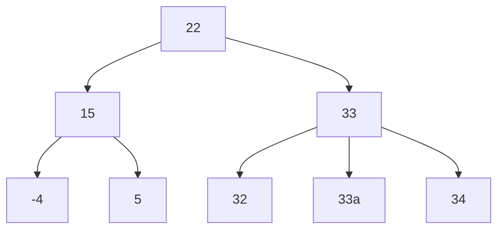

# Binäre Suchbäume vs Binärbäume
## 1. Begründen Sie bei welchem der folgenden Bäume es sich nicht um einen binären Suchbaum handelt 

### a)

```java
           22
       /       \
     15         33
    /  \      /  |  \
  -4    5    32  33  34

```

> 33a = 33, musste es so schreiben, da 33 schon benutzt wird 


- Kein Binärer Suchbaum, da 33 mehr als 2 Kinder hat 
- Normalerweise ist in einem Binären Suchbaum keine Duplikate erlaubt, da gilt :
	- Alle Werte im **linken Teilbaum** eines Knotens müssen **kleiner** als der Wert des Knotens selbst sein
	- Alle Werte im **rechten Teilbaum** eines Knotens müssen **größer** als der Wert des Knotens selbst sein
	- (es gibt Ausnahmen aber diese sind dann, extra definiert. In der Schule eigentlich nie definiert ausser dein Lehrer sagt was anderes)

### b)

```java
        9
       / \
      0   13
       \
        7
       /
      3
     /
    2
   /
  1

```

- Binärer Suchbaum
	- Jeder Knoten $\leq$  2 Kinder
	- Linker Teilbaum immer kleiner als Knoten
	- Rechter Teilbaum immer größer als Knoten

### c)
 
```java
       26.03.2001
       /          \
  05.06.2000     02.10.2001
       \            /
    24.12.2000  05.10.2001

```

Der gegebene Baum ist **kein** binärer Suchbaum (BST), da die Eigenschaft verletzt wird, dass alle Knoten im linken Teilbaum kleiner und alle Knoten im rechten Teilbaum größer als der aktuelle Knoten sein müssen. Der Knoten `05.10.2001` im linken Teilbaum von `02.10.2001` ist jedoch größer, was gegen die BST-Regeln verstößt.

**Annahme:** Die Datumsangaben im Baum werden chronologisch geordnet, wobei frühere Daten als "kleiner" und spätere Daten als "größer" betrachtet werden. Diese Annahme basiert auf dem zeitlichen Ablauf der Daten und dient als Vergleichslogik für die Behandlung des Baumes als BST.

### d)

```java
implementieren
      \
   implodieren
         \
     imponieren
           \
     imprägnieren
               \
       improvisieren

```

#### implementieren und implodieren 

| 1   | 2   | 3   | 4   | 5   | 6   | 7   | 8   | 9   | 10  | 11  | 12  | 13  |
| --- | --- | --- | --- | --- | --- | --- | --- | --- | --- | --- | --- | --- |
| i   | m   | p   | l   | e   | m   | e   | n   | t   | i   | e   | r   | e   |
| i   | m   | p   | l   | o   | d   | i   | e   | r   | e   | n   |     |     |

- Unterscheiden sich erst im 5. Character `e vs o`
- `"o" > "e" => true`
- implodieren steht richtigerweise rechts von implementieren

#### implodieren und imponieren

| Position | 1   | 2   | 3   | 4   | 5   | 6   | 7   | 8   | 9   | 10 | 11 |
|----------|-----|-----|-----|-----|-----|-----|-----|-----|-----|----|----|
| **implodieren** | i   | m   | p   | l   | o   | d   | i   | e   | r   | e  | n  |
| **imponieren**  | i   | m   | p   | o   | n   | i   | e   | r   | e   | n  |    |

- **Unterscheiden sich erst im 4. Zeichen**: `l` vs `o`
- **Vergleich**: `'o' > 'l'` ist `true` (da der Unicode-Wert von 'o' (111) größer ist als der von 'l' (108))
- **Folgerung**: *imponieren* steht richtigerweise **rechts** von *implodieren*

#### imponieren und imprägnieren

| Position | 1   | 2   | 3   | 4   | 5   | 6   | 7   | 8   | 9   | 10 | 11 | 12 |
|----------|-----|-----|-----|-----|-----|-----|-----|-----|-----|----|----|----|
| **imponieren**   | i   | m   | p   | o   | n   | i   | e   | r   | e   | n  |    |    |
| **imprägnieren** | i   | m   | p   | r   | ä   | g   | n   | i   | e   | r  | e  | n  |

- **Unterscheiden sich erst im 4. Zeichen**: `o` vs `r`
- **Vergleich**: `'r' > 'o'` ist `true` (Unicode-Wert von 'r' (114) > 'o' (111))
- **Folgerung**: *imprägnieren* steht richtigerweise **rechts** von *imponieren*

#### imprägnieren und improvisieren

| Position | 1   | 2   | 3   | 4   | 5    | 6    | 7   | 8   | 9   | 10 | 11 | 12 | 13 |
|----------|-----|-----|-----|------|------|-----|-----|-----|-----|----|----|----|----|
| **imprägnieren**   | i   | m   | p   | r    | ä    | g   | n   | i   | e   | r  | e  | n  |    |
| **improvisieren**  | i   | m   | p   | r    | o    | v   | i   | s   | i   | e  | r  | e  | n  |

- **Unterscheiden sich erst im 5. Zeichen**: `ä` vs `o`
- **Vergleich**:
  - Unicode-Wert von `'ä'` (228) und `'o'` (111)
  - `'ä' < 'o'` ist `false`
- **Folgerung**: *improvisieren* steht FÄLSCHLICHERWEISE **rechts** von *imprägnieren*

#### Zusammenfassung des Baums

Der resultierende **richtige** binäre Suchbaum basierend auf den Vergleichen sieht wie folgt aus:

```
        implementieren
               \
           implodieren
                  \
              imponieren
                    \
                imprägnieren
                  /
          improvisieren
```

- **Anmerkung**: *improvisieren* ist ein linker Kindknoten von *imprägnieren*, da `'o' < 'ä'`.

#### Erklärung der Vergleiche

Bei der Erstellung des Baums werden die Wörter nach lexikografischer Ordnung sortiert, basierend auf dem Vergleich der einzelnen Zeichen (Unicode-Werte):

1. **Vergleich von Zeichen an gleicher Position**: Beginne beim ersten Zeichen und vergleiche jedes Zeichen der Wörter nacheinander.
2. **Entscheidungspunkt**: Sobald ein Unterschied festgestellt wird, entscheidet der Vergleich der Unicode-Werte, in welche Richtung der Baum verzweigt.
   - Wenn das Zeichen des neuen Wortes größer ist, geht es nach **rechts**.
   - Wenn es kleiner ist, geht es nach **links**.
3. **Fortsetzung des Prozesses**: Wiederhole den Vergleich an der Position des Unterschieds für die weiteren Wörter, um ihre Position im Baum zu bestimmen.

#### Fazit

Der gegebene Baum ist kein Binärer Suchbaum

---

## 2. Ordnen Sie jede der gegebenen Darstellungen begründet einer oder mehrerer der folgenden Strukturen zu:

### a)

- **Wahrscheinlichkeitsbaum** (Entscheidungsbaum).
- **Keine Werte in der Wurzel** → kein Binärbaum oder binärer Suchbaum.
- Knoten repräsentieren Wahrscheinlichkeiten, nicht sortierte Werte.
- Kein typischer Baum, da die Wurzel leer ist.


### b)

- **Binärbaum**, da jeder Knoten maximal zwei Kinder hat.
- **Kein binärer Suchbaum**, da die Knoten nicht nach einer bestimmten Regel (z.B. Zahlenordnung) sortiert sind.

### c)

- **Kein Baum**, da zyklische Verbindung zwischen Frankfurt,Würzburg und Köln
	- impliziert auch eine Verbindung auf gleicher Ebene (Frankfurt und Würzburg), was nicht erlaubt ist

### d)

- **Baum**, aber kein Binärbaum, da Schule mehr als 2 Kinder hat.
- Somit auch kein Binärbaum
- → Directory Tree / Ordnerbaum / Verzeichnisbaum

---

## Aufgabe 3

### a) Geben Sie den binären Suchbaum an, der entsteht, wenn nacheinander die untenstehenden Schlüssel eingefügt werden.

```
17; 23; 42; 19; 10; 11; 5; 21; 20; 22; 18; 4; 3
```

>Geben Sie den Baum an, der entsteht, wenn anschließend die Knoten mit den Schlüsseln 5 und 23 aus dem Suchbaum entfernt werden.

![[Figure_1.png]]

#### Baum nach dem Entfernen von 5 und 23:

![[Figure_2.png]]

Um die Knoten mit den Schlüsseln `5` und `23` aus dem binären Suchbaum zu entfernen, müssen wir eine Funktion implementieren, die diese Schlüssel korrekt aus dem Baum löscht. Dabei gibt es drei Fälle, die beim Entfernen eines Knotens zu berücksichtigen sind:

1. **Der Knoten hat keine Kinder (Blattknoten)**: Der Knoten wird einfach gelöscht.
2. **Der Knoten hat ein Kind**: Der Knoten wird gelöscht, und sein Kind ersetzt ihn.
3. **Der Knoten hat zwei Kinder**: Der Knoten wird durch den Nachfolger im Inorder-Traversal (den kleinsten Knoten im rechten Teilbaum) ersetzt.


- Weiters Beispiel

![[Figure_3.png]]
### b) Geben Sie den binären Suchbaum an, der entsteht, wenn die obigen Schlüssel in umgekehrter Reihenfolge eingefügt werden.

> 3, 4, 18, 22, 20, 21, 5, 11, 10, 19, 42, 23, 17

![[Pasted image 20240913013421.png]]
### c) Die Preorder-Ausgabe eines Suchbaums lautet: 12, 3, 0, 2, 7, 14, 13, 18, 15, 21. Zeichnen Sie den zugehörigen Suchbaum.

![[Pasted image 20240913013838.png]]
### d) Entwickeln Sie eine Strategie, um das größte Element in einem binären Suchbaum aufzufinden.


```java
public static  void maxElement(Node n) {  
    if (n == null) {  
        return;  
    }  
    while (n.right != null) n = n.right;  
    System.out.println("\n"+"Max Element: "+n.value);  
}
```
